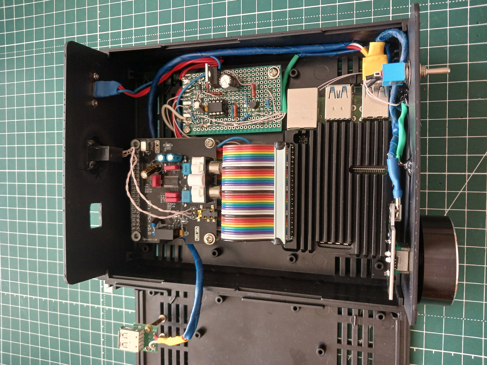

# Moode-Audio-Hub
Smart power management and audio control hub for Raspberry Pi 4 running Moode Audio, powered by ATtiny13.

# 🎵 Moode Audio Hub

**Moode Audio Hub** — це апаратно-програмне DIY-рішення для автоматизації керування живленням та розширення функціоналу аудіоплеєра на базі **Raspberry Pi 4** під керуванням **Moode Audio**.
Проєкт об'єднує три основні підсистеми:
1. **Контролер живлення на базі ATtiny13:** керує подачею живлення Raspberry Pi 4 та забезпечує повний цикл безпечного вимкнення (Safe Shutdown). Стан системи відображається за допомогою двоколірного світлодіода.
2. **Аудіоінтерфейс:** звукова карта (ЦАП), підключена до Raspberry Pi через GPIO (I2S) для виведення Hi-Fi звуку.
3. **Органи керування:** Фізичний тумблер ON/OFF для керування живленням, а також USB-енкодер для апаратного регулювання рівня гучності та керування відтворенням (Play/Pause).

---

## 🟢 Режими індикації стану системи (Двоколірний LED, спільний катод)

* **🔴 Червоний (стабільно світиться)**: режим очікування (Standby). Raspberry Pi 4 знеструмлена.
* **🟢 Зелений (повільно блимає):** етап завантаження (Booting). Живлення подано на Raspberry Pi 4, Moode Audio завантажуються.
* **🟢 Зелений (стабільно світиться):** робочий режим (Operational). Moode Audio повністю завантажена, локальний веб-інтерфейс доступний, система готова до роботи.
* **🟢 Зелений (швидко блимає):** процес безпечного вимкнення (Shutdown). Виконується завершення роботи ОС.  

  Зелений канал LED керується безпосередньо ATtiny13 через PB5. Червоний канал має окреме транзисторне керування.
---

## ⚙️ Логіка взаємодії (ATtiny13 <-> Raspberry Pi 4)

Проєкт реалізує повністю автоматичне узгодження станів живлення:

1. **Ввімкнення:** При переведенні тумблера в положення `ON` ATtiny13 переходить зі стану `STATE_OFF` у `STATE_DOWNLOADING`. ATtiny13 встановлює логічний `0` на `PB0`, відкриваючи P-канальний MOSFET і подаючи живлення на Raspberry Pi 4.
2. **Завантаження системи:** У стані `STATE_DOWNLOADING` ATtiny13 очікує сигнал готовності від Raspberry Pi. Після повного запуску необхідних служб та доступності веб-інтерфейсу Moode Audio Raspberry Pi встановлює логічну `1` на `GPIO23`, який підключений до `PB1` ATtiny13. Отримання логічної `1` переводить контролер у стан `STATE_ON`. Під час завантаження зелений LED повільно блимає.
3. **Робочий режим:** У стані `STATE_ON` Raspberry Pi 4 залишається увімкненою, а зелений LED світиться постійно. Переведення тумблера в положення `OFF` переводить ATtiny13 у стан `STATE_SHUTDOWN`.
4. **Ініціація вимкнення:** У стані `STATE_SHUTDOWN` ATtiny13 встановлює логічну `1` на `PB4`. Через узгоджувальний резистивний ланцюг цей сигнал надходить на `GPIO6` Raspberry Pi 4. Служба `gpio6-shutdown.service` виявляє подію на `GPIO6` за допомогою `gpiomon` та запускає: `systemctl poweroff`. Зелений LED швидко блимає.
5. **Визначення завершення `shutdown`:** Після завершення процедури `shutdown` зникає напруга `+3.3 V` на physical pin 1 Raspberry Pi 4. Цей сигнал підключений до `PB2` ATtiny13 і використовується як `Shutdown complete`. Коли напруга на `PB2` зникає, ATtiny13 визначає завершення роботи Raspberry Pi та переходить у стан `STATE_DELAY_OFF`.
6. **Затримка перед фізичним знеструмленням:** У стані `STATE_DELAY_OFF` Raspberry Pi ще залишається фізично під живленням протягом 6 секунд. Після завершення затримки ATtiny13 переходить у `STATE_POWER_OFF_DELAY` і закриває P-канальний MOSFET, фізично знеструмлюючи Raspberry Pi 4. Після цього витримується додаткова затримка 2 секунди, після чого контролер повертається у стан `STATE_OFF`.

---

## 🔧 Налаштування служб автозапуску в Moode Audio

Для інтеграції з Linux у системі використовуються дві служби `systemd`.

### 1. Сигнал готовності Moode Audio

Служба запускається після `nginx`, `php8.4-fpm` та `mpd` і очікує доступності локального веб-інтерфейсу Moode Audio.  
Після успішної HTTP-відповіді встановлюється високий рівень на `GPIO23`.

* **Скрипт `/usr/local/bin/moode-ready.sh`:**
```bash
#!/bin/bash

# Очікування відповіді від локального веб-сервера
while ! curl -fsS -o /dev/null http://localhost/; do
    sleep 1
done

# Сигнал Ready для ATtiny13
exec /usr/bin/gpioset --chip gpiochip0 23=1
```

* **Служба `/etc/systemd/system/moode-ready.service`:**
```ini
[Unit]
Description=moOde ready signal
After=nginx.service php8.4-fpm.service mpd.service
Requires=nginx.service php8.4-fpm.service mpd.service

[Service]
Type=simple
ExecStart=/usr/local/bin/moode-ready.sh
Restart=no

[Install]
WantedBy=multi-user.target
```

### 2. Підсистема безпечного вимкнення (Safe Shutdown)

Служба очікує подію на `GPIO6` за допомогою `gpiomon`.  

`gpiomon` використовує `event-driven monitoring` і не потребує постійного опитування `GPIO` процесором.

* **Скрипт `/usr/local/bin/gpio6-shutdown.sh`:**
```bash
#!/bin/bash
# Очікування події вимкнення на GPIO 6
/usr/bin/gpiomon --chip gpiochip0 --edges rising --num-events 1 GPIO6
# Ініціація коректного вимкнення системи
/usr/bin/systemctl poweroff
```

* **Служба `/etc/systemd/system/gpio6-shutdown.service`:**
```ini
[Unit]
Description=Shutdown on GPIO6 command
After=multi-user.target

[Service]
Type=simple
ExecStart=/usr/local/bin/gpio6-shutdown.sh
Restart=no

[Install]
WantedBy=multi-user.target
```

## 🎛️ Апаратне керування звуком (USB-енкодер)

Для регулювання гучності та керування відтворенням використовується USB HID-енкодер, який розпізнається системою як мультимедійна клавіатура. Обробка натискань та прокручування реалізована через системний демон `triggerhappy`.

### Конфігурація гарячих клавіш `/etc/triggerhappy/triggers.d/moode.conf`:

```ini
# Збільшення гучності на 2% при прокручуванні праворуч
KEY_VOLUMEUP    1      /var/www/util/vol.sh --up 2

# Зменшення гучності на 2% при прокручуванні ліворуч
KEY_VOLUMEDOWN  1      /var/www/util/vol.sh --dn 2

# Перемикання Play/Pause при натисканні на кнопку енкодера
KEY_MUTE        1      /usr/bin/mpc toggle
```
Після зміни конфігурації необхідно перезапустити `triggerhappy`:  
`sudo systemctl restart triggerhappy`

## 🛠️ Особливості монтажу та конструкції

Оскільки звукова карта встановлюється на GPIO-роз'єм Raspberry Pi 4 і перекриває доступ до інших пінів, для підключення плати керування та організації живлення було використано **GPIO розширювач (Y-splitter)** з конфігурацією:
* **Вхід:** `40-pin Female` — підключається безпосередньо до GPIO Raspberry Pi.
* **Виходи:** Два паралельні роз'єми `40-pin Male`.

### Схема розміщення та комутації:
1. **Перший роз'єм 40-pin Male:** З'єднується зі звуковою картою (ЦАП) за допомогою гнучкого шлейфа довжиною **10 см**. Це дозволяє вільно розмістити звукову карту.
2. **Другий роз'єм 40-pin Male:** Використовується для комутації плати керування:
   * **Керуючі лінії:** Сигнали `GPIO 6`, `GPIO 23`, лінія контролю `3.3V` та `GND` підпаюються до відповідних контактів роз'єму окремими провідниками.
   * **Магістраль живлення:** через цей же роз'єм (піни `+5V` та `GND`) подається основне силове живлення `+5V` з плати керування для живлення Raspberry Pi 4 та звукової карти.

⚠️ *Важливе зауваження: при такій схемі живлення +5V подається в обхід штатного роз'єму USB-C Raspberry Pi. Категорично забороняється одночасно підключати зовнішній блок живлення до USB-C роз'єму Raspberry Pi та подавати +5V з плати керування на GPIO.*  

## 📷 Внутрішній монтаж

Фото внутрішнього монтажу пристрою:

  

